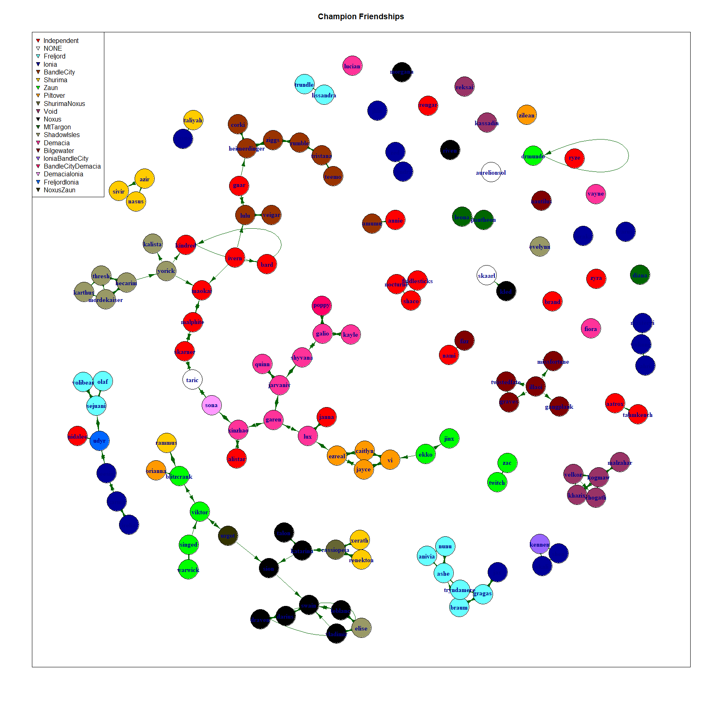
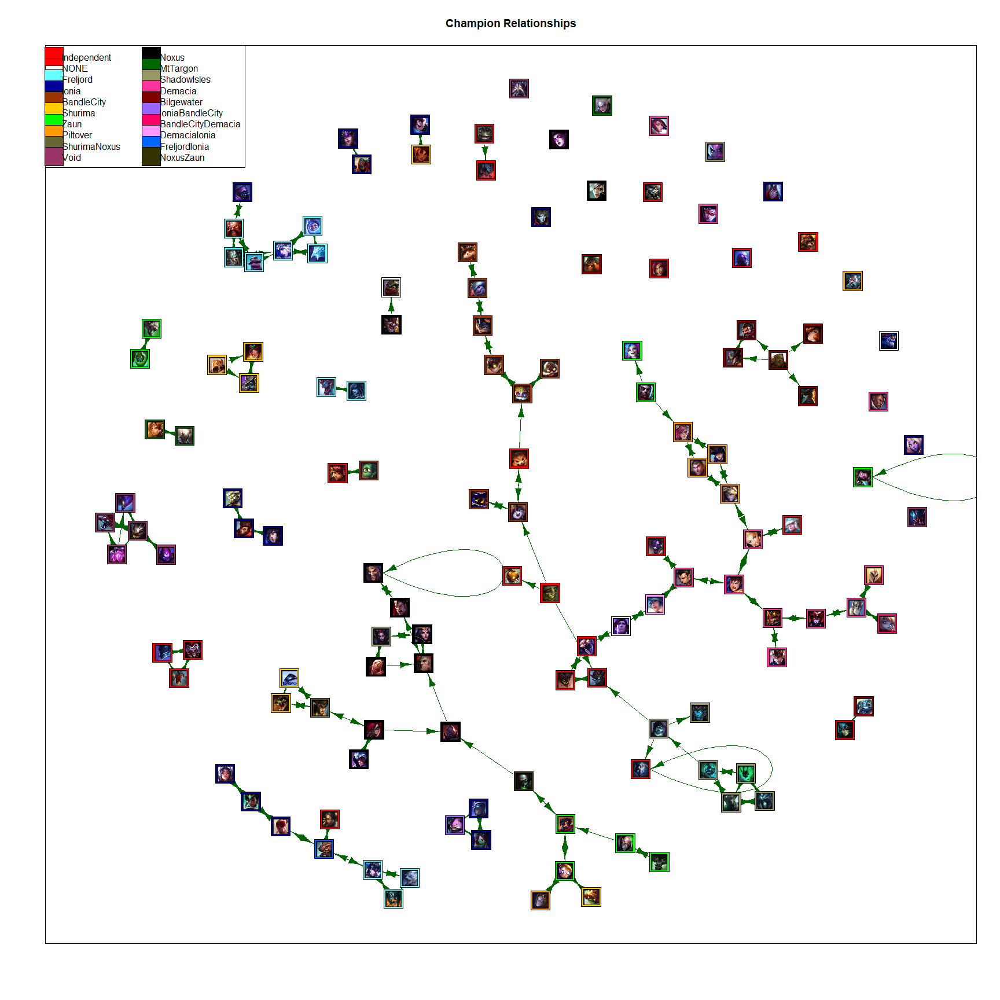

# Introduction

Give an interpretation of the results of each computation.

Direct the reader's attention to the features you want them to observe in each plot.

If your plots and computations allow you to draw any conclusions about your data, do so.

Perform at least one computation.

We discussed some network and vertex measures in class on 10/17, but there are others documented in the igraph manual.
Furthermore, you can do other computations in R using any of the code you've learned to write earlier in our course.

***For instance, you might compute the betweenness centrality of your vertices, if the interpretation of that measure discussed in class on 10/17 is relevant to your network.***

***Provide a clear write-up of all the (non-boring) things you did on this project.***

***How did you plan and execute the data gathering?***

***What difficulties (if any) arose when you tried to represent your data clearly as a graph?***

  images, json files
  
***What computation did you do and why do you think its results mean?***

***Why are they informative or interesting for your network?***


## How I got my data

I chose to use Riot Games: League of Legends Champion relationships as the Social Network for the project.

I did not want to spend a couple hours going through the champion pages and grabbing the relationships, so I wrote a webscrapping script in Python that queries the Riot API for a list of all the champions and then scrapes all the champion relationship information from the relevant url.

All of this data was then downloaded into a JSON file similar to this format:

  {
  
    Champion_name:
    
    Faction:
  
    Rivals:
  
    Friends:
  
  }

Feel free to take a look at my [champion_relationships](https://github.com/sserrot/champion_relationships) repository on GitHub for more information on that process.

### Lets take a look at the data we got in our newly created .json file.

I use the `jsonlite` package to read the champions.json file into a dataframe of lists


```r
champ_relations = fromJSON("champions.json")
```

#### Number of Champions


```r
numChampions <- nrow(champ_relations)
numChampions
```

```
## [1] 133
```

#### Column Names

```r
colnames(champ_relations)
```

```
## [1] "friends"       "champion_name" "faction"       "rivals"
```

I changed the order of the columns to better represent the data.


```r
newchamp_relations <- champ_relations[,c(2,3,1,4)]
```

Here's a brief look at the data


```r
head(newchamp_relations)
```

```
##   champion_name     faction                  friends           rivals
## 1        Aatrox Independent                                Tryndamere
## 2   AurelionSol                                                      
## 3        Anivia    Freljord               Ashe, Nunu Brand, Lissandra
## 4         Akali       Ionia             Shen, Kennen              Zed
## 5          Ashe    Freljord Tryndamere, Anivia, Nunu          Sejuani
## 6         Amumu  BandleCity                    Annie
```

Here is the first problem I encountered in the dataset:

  a. Working with *JSON*


```r
# lets try create a vector of all the champions
testVertexNames <- as.vector(newchamp_relations$champion_name)
head(testVertexNames)
```

```
## [[1]]
## [1] "Aatrox"
## 
## [[2]]
## [1] "AurelionSol"
## 
## [[3]]
## [1] "Anivia"
## 
## [[4]]
## [1] "Akali"
## 
## [[5]]
## [1] "Ashe"
## 
## [[6]]
## [1] "Amumu"
```

As you can see, the information is embedded into the lists in the dataframe, so we have to iterate through it to get the information. 

# Creating the graph requirements

## Vertex creation

### Vertex names


```r
vertexNames <- c()

for (champ in newchamp_relations$champion_name){
  vertexNames = c(vertexNames,tolower(champ))
}
```

Here is the summary of the new information, properly represented.


```r
head(vertexNames)
```

```
## [1] "aatrox"      "aurelionsol" "anivia"      "akali"       "ashe"       
## [6] "amumu"
```

I ran into another error later in the process where `igraph` would refuse to connect the relationships I create later.

It turns out that while I collected all the champion relationship data, there is a champion that has a relationship with a nonchampion.

Here is the code where I added its name.


```r
vertexNames = c(vertexNames, "skaarl")
```


## Creating Connections/Edges

### Friends edges creation

Now we should store the relationships, or edges, in order to graph our Social Network.

In order to add our edges of friends, we have to iterate through the dataframe again, storing the friends information.

Here is a brief look at the dataframe:


```r
head(newchamp_relations$friends)
```

```
## [[1]]
## [1] ""
## 
## [[2]]
## [1] ""
## 
## [[3]]
## [1] "Ashe" "Nunu"
## 
## [[4]]
## [1] "Shen"   "Kennen"
## 
## [[5]]
## [1] "Tryndamere" "Anivia"     "Nunu"      
## 
## [[6]]
## [1] "Annie"
```

since JSON stores multiple friends in one pair with their respective champion, we cannot use the same iteration method we used for the vertex names.

Edges are also more complex because we have to store the champion with its edge so there must be a Source list and a Target list. 


Here is the code for the friends edges


```r
edgeFriendsSource <- c() #empty edge for loop
edgeFriendsTarget <- c()

i = 1
f = 1

while(i <= numChampions) {
  champName = newchamp_relations$champion_name[[i]]
  numFriends = length(newchamp_relations$friends[[i]])
  
  while (numFriends > 0 && f <= numFriends){
    if (newchamp_relations$friends[[i]][f] != "")
      {
      edgeFriendsSource = c(edgeFriendsSource,tolower(champName))
      edgeFriendsTarget = c(edgeFriendsTarget, tolower(newchamp_relations$friends[[i]][f]))
    }
    f = f + 1
    }
  f = 1
  i = i +1
}
```

Lets check to make sure it worked


```r
head(edgeFriendsSource)
```

```
## [1] "anivia" "anivia" "akali"  "akali"  "ashe"   "ashe"
```

```r
head(edgeFriendsTarget)
```

```
## [1] "ashe"       "nunu"       "shen"       "kennen"     "tryndamere"
## [6] "anivia"
```

### Create Faction Attributes

Lets create the attributes for the faction of champions.

This is to make the graph slightly more interesting so we can see if relationships are clustered by faction.

The code for this is very similar to the friends edges code. (I've hard coded the 134 for now)


```r
i = 1
f = 1
edgeFactionSource <- c()
edgeFactionTarget <- c()

while(i <= numChampions) {
  for (faction in newchamp_relations$faction){
    if (f <= (numChampions)) {
      if (newchamp_relations$faction[[f]] !="" && f <= (numChampions)) # we have to check Skaarl who has no faction
      {
        champName = newchamp_relations$champion_name[[f]] #133
        edgeFactionSource = c(edgeFactionSource, tolower(champName))
        edgeFactionTarget = c(edgeFactionTarget, newchamp_relations$faction[[f]])
      }
      f = f + 1
    }
  }
  i = i+1
}
```

And here is the result


```r
head(edgeFactionSource)
```

```
## [1] "aatrox" "anivia" "akali"  "ashe"   "amumu"  "azir"
```

```r
head(edgeFactionTarget)
```

```
## [1] "Independent" "Freljord"    "Ionia"       "Freljord"    "BandleCity" 
## [6] "Shurima"
```

### Rivals edges creation
Lets create the rival connections for the graph.

There was another error thrown later in the graphing due to improper champion naming.

That is fixed by the last line where I replace `monkeyking` with `wukong`

You'll notice it is only one list instead of two like the others.
This is because `friends` and `factions` will be dataframes, but `rivals` must be a list in order to use
`add_edges` later in the graphing process.


```r
edgeRivals <- c() #empty edge for loop

i = 1
f = 1

while(i <= numChampions) {
  
  champName = newchamp_relations$champion_name[[i]]
  
  numRivals = length(newchamp_relations$rivals[[i]])
  
  while (numRivals > 0 && f <= numRivals){
    if (newchamp_relations$rivals[[i]][f] !="")
      {
      edgeRivals = c(edgeRivals,tolower(champName), tolower(newchamp_relations$rivals[[i]][f]))
    }
    f = f + 1
    }
  f = 1
  i = i +1
}
edgeRivals[276] = "wukong" # it was labeled as monkeyking, which threw errors in the graph
```

## Graphing the data

Here are all the global variables for the graphing portion


```r
# globals
vertexSize <- 7
vLabelSize <- 1
vLabelDist <- 0
vLabelColor <- "darkblue"
vLabelFont <- 2 # bold text
vLabelDegree = -pi/2
eArrowSize <- 1
eArrowWidth<- .7
```

Graph of both


```r
dfEdge = as.data.frame(edgeFriendsSource, stringsAsFactors=FALSE)
dfEdge["friendsTarget"] = edgeFriendsTarget

# vertex dataframe
dfVertex = as.data.frame(vertexNames, stringsAsFactors=FALSE)
dfVertex["ID"] = vertexNames

both = graph_from_data_frame(d=dfEdge, vertices = dfVertex, directed = T)
E(both)$color <- "darkgreen" # green for friends
both <- add_edges(both, edgeRivals, attr=list(color="red")) #red for enemies

head(dfEdge)
```

```
##   edgeFriendsSource friendsTarget
## 1            anivia          ashe
## 2            anivia          nunu
## 3             akali          shen
## 4             akali        kennen
## 5              ashe    tryndamere
## 6              ashe        anivia
```

```r
head(dfVertex)
```

```
##   vertexNames          ID
## 1      aatrox      aatrox
## 2 aurelionsol aurelionsol
## 3      anivia      anivia
## 4       akali       akali
## 5        ashe        ashe
## 6       amumu       amumu
```

Here we add factions to the graph


```r
V(both)$Faction = as.character(edgeFactionTarget[match(V(both)$name, edgeFactionSource)])
head(V(both)$Faction)
```

```
## [1] "Independent" NA            "Freljord"    "Ionia"       "Freljord"   
## [6] "BandleCity"
```

```r
allFactions = unique(V(both)$Faction)
allFactions
```

```
##  [1] "Independent"       NA                  "Freljord"         
##  [4] "Ionia"             "BandleCity"        "Shurima"          
##  [7] "Zaun"              "Piltover"          "ShurimaNoxus"     
## [10] "Void"              "Noxus"             "MtTargon"         
## [13] "ShadowIsles"       "Demacia"           "Bilgewater"       
## [16] "IoniaBandleCity"   "BandleCityDemacia" "DemaciaIonia"     
## [19] "FreljordIonia"     "NoxusZaun"
```

```r
factionColors <- c('#FF0000',NA,'#66FFFF','#000099','#993300','#FFCC00','#00FF00','#FF9900','#666633','#993366', '#000000','#006600','#999966','#FF3399','#800000','#9966FF','#FF0066','#FF99FF','#0066FF','#333300')
# factionColors <- c('#FF0000',NA,'lightblue','blue','brown','gold','lawngreen','orange',NA,'purple', 'black','darkgreen','darkgray','ivory','darkblue',NA,NA,NA,NA,NA)
# add a key for colors
factionNumber <- function ( faction ) {
  match( faction, allFactions )}
V(both)$color <- factionColors[factionNumber(V(both)$Faction)]
```

Friends graph

```r
friends <- graph_from_data_frame(d=dfEdge, vertices = dfVertex, direct = T)

E(friends)$color <- "darkgreen" # green for friends
V(friends)$Faction = as.character(edgeFactionTarget[match(V(friends)$name, edgeFactionSource)])

allFactions = unique(V(friends)$Faction)

V(friends)$color <- factionColors[factionNumber(V(friends)$Faction)]
V(friends)$size <- vertexSize
V(friends)$label.cex <- vLabelSize
V(friends)$label.dist <- vLabelDist
V(friends)$label.color <- vLabelColor
V(friends)$label.font <- vLabelFont
V(friends)$label.degree = vLabelDegree
E(friends)$arrow.size <- eArrowSize
E(friends)$arrow.width <- eArrowWidth

plot(friends, frame = TRUE, main = "Champion Friendships")

legendAllFactions = allFactions
legendAllFactions[2] = "NONE"

# legend(x=-1.5, y=-1.1, allFactions, pch=21,
#         col="#777777", pt.bg="blue", pt.cex=2, cex=.8, bty="n", ncol=1)
legend('topleft',legend= legendAllFactions,col='black',pch=25, pt.bg=factionColors)
```

<!-- -->

## Graph Calculations

#### Betweenness


```r
highest <- max(betweenness(friends))
index_of_highest <- match(highest, betweenness(friends))
print(index_of_highest) 
```

```
## [1] 32
```

```r
friends[[index_of_highest]] 
```

```
## $garen
## + 3/134 vertices, named, from 9078bde:
## [1] jarvaniv lux      xinzhao
```

```r
#garen between friends

highest <- max(betweenness(both)) 
index_of_highest <- match(highest, betweenness(both)) 
print(index_of_highest) 
```

```
## [1] 32
```

```r
both[[index_of_highest]] 
```

```
## $garen
## + 6/134 vertices, named, from 906f278:
## [1] jarvaniv katarina lux      swain    urgot    xinzhao
```

```r
#garen again
```

#### Closeness Least Friends, Rivals, Both


```r
closest <- min(closeness(friends))
```

```
## Warning in closeness(friends): At centrality.c:2784 :closeness centrality is not
## well-defined for disconnected graphs
```

```r
index_of_closest <- match(closest, closeness(friends))
```

```
## Warning in closeness(friends): At centrality.c:2784 :closeness centrality is not
## well-defined for disconnected graphs
```

```r
print(index_of_closest) 
```

```
## [1] 1
```

```r
friends[[index_of_closest]] 
```

```
## $aatrox
## + 0/134 vertices, named, from 9078bde:
```

```r
#aatrox friends

closest <- min(closeness(both)) 
```

```
## Warning in closeness(both): At centrality.c:2784 :closeness centrality is not
## well-defined for disconnected graphs
```

```r
index_of_closest <- match(closest, closeness(both)) 
```

```
## Warning in closeness(both): At centrality.c:2784 :closeness centrality is not
## well-defined for disconnected graphs
```

```r
print(index_of_closest) 
```

```
## [1] 2
```

```r
both[[index_of_closest]] 
```

```
## $aurelionsol
## + 0/134 vertices, named, from 906f278:
```

```r
#aurelionsol again
```

#### Closeness Most Friends, Rivals, Both


```r
most <- max(closeness(friends))
```

```
## Warning in closeness(friends): At centrality.c:2784 :closeness centrality is not
## well-defined for disconnected graphs
```

```r
index_of_most <- match(most, closeness(friends))
```

```
## Warning in closeness(friends): At centrality.c:2784 :closeness centrality is not
## well-defined for disconnected graphs
```

```r
print(index_of_most) 
```

```
## [1] 40
```

```r
friends[[index_of_most]] 
```

```
## $ivern
## + 3/134 vertices, named, from 9078bde:
## [1] bard   lulu   maokai
```

```r
#ivern friends (3)

most <- max(closeness(both)) 
```

```
## Warning in closeness(both): At centrality.c:2784 :closeness centrality is not
## well-defined for disconnected graphs
```

```r
index_of_most <- match(most, closeness(both)) 
```

```
## Warning in closeness(both): At centrality.c:2784 :closeness centrality is not
## well-defined for disconnected graphs
```

```r
print(index_of_most) 
```

```
## [1] 55
```

```r
both[[index_of_most]] 
```

```
## $kled
## + 134/134 vertices, named, from 906f278:
##   [1] aatrox       aurelionsol  anivia       akali        ashe        
##   [6] amumu        azir         annie        bard         blitzcrank  
##  [11] brand        caitlyn      braum        ahri         cassiopeia  
##  [16] chogath      alistar      darius       diana        corki       
##  [21] draven       drmundo      evelynn      ekko         ezreal      
##  [26] fiddlesticks fiora        elise        fizz         galio       
##  [31] gangplank    garen        gnar         gragas       graves      
##  [36] hecarim      illaoi       heimerdinger irelia       ivern       
##  [41] janna        jarvaniv     jax          jayce        jhin        
##  [46] jinx         kalista      karma        kassadin     katarina    
## + ... omitted several vertices
```

```r
#kled again
```


#### Eigenvector Centrality, most influential vertex


```r
# set.seed(2)
# #errorszzzzzzzzz randomlly
# influential <- max(evcent(rivals)$vector)
# index_of_influential <- match(influential, evcent(rivals)$vector)
# print(index_of_influential)
# rivals[[index_of_influential]]
# #kled most rivals
# 
# influential <- max(evcent(friends)$vector)
# index_of_influential <- match(influential, evcent(friends)$vector)
# print(index_of_influential)
# friends[[index_of_influential]]
# #ivern friends (3)
# 
# most <- max(evcent(both)$vector)
# index_of_influential <- match(influential, evcent(both)$vector)
# print(index_of_influential)
# both[[index_of_influential]]
# #kled again
```


#### Images in Graph

```r
imgname <- list()
imgfilename <- list()
for (x in 1:134)
    {
    imgname = c(imgname, paste(vertexNames[x], ".png", sep =""))
    imgfilename <- c(imgfilename, file.path(path_to_files,imgname[[x]]))
    }
```

Both Image Graph


```r
set.seed(1)

l <- layout.norm(layout.fruchterman.reingold(both, niter = 500))

V(both)$label.cex <- .01
V(both)$size <- .008
E(both)$arrow.size <- 1.25
E(both)$arrow.width <- 1
V(both)$size <- 4.75
V(both)$shape <- "square"

plot(both, layout = l, frame = TRUE, main = "Champion Relationships")

img <- lapply(imgfilename, png::readPNG)
```

```
## Warning in FUN(X[[i]], ...): libpng warning: iCCP: known incorrect sRGB profile
```

```r
for(i in 1:nrow(l)) {  
  rasterImage(img[[i]], l[i, 1]-0.02, l[i, 2]-0.02, l[i, 1]+0.02, l[i, 2]+0.02)
}

legend('topleft',legend= legendAllFactions,pch=22, pt.cex = 4, pt.bg=factionColors, ncol = 2)
```

<!-- -->

Friends Image Graph


```r
set.seed(1)
# arrows point to x is friends with
l <- layout.norm(layout_with_fr(friends, niter = 500, start.temp = 20 ))

V(friends)$label.cex <- .01
V(friends)$size <- 4.75
V(friends)$shape <- "square"
E(friends)$arrow.size <- 1.25

plot(friends, layout = l, frame = TRUE, main = "Champion Relationships")

img <- lapply(imgfilename, png::readPNG)
```

```
## Warning in FUN(X[[i]], ...): libpng warning: iCCP: known incorrect sRGB profile
```

```r
for(i in 1:nrow(l)) {  
  rasterImage(img[[i]], l[i, 1]-0.02, l[i, 2]-0.02, l[i, 1]+0.02, l[i, 2]+0.02)
}

legend('topleft',legend= legendAllFactions,pch=22, pt.cex = 5, pt.bg=factionColors, ncol = 2)
```

<!-- -->

Here we remove kled from the graph to see what it would look like

```r
set.seed(1)

bnk = both - "kled"

l <- layout.norm(layout.fruchterman.reingold(bnk, niter = 500, start.temp = 20))

V(bnk)$label.cex <- .001
E(bnk)$arrow.size <- 1.25
E(bnk)$arrow.width <- 1
V(bnk)$size <- 4.75
V(bnk)$shape <- "square"

plot(bnk, layout = l, frame = TRUE, main = "Champion Relationships")


img <- lapply(imgfilename, png::readPNG)
```

```
## Warning in FUN(X[[i]], ...): libpng warning: iCCP: known incorrect sRGB profile
```

```r
for(i in 1:nrow(l)) {
  rasterImage(img[[i]], l[i, 1]-0.02, l[i, 2]-0.02, l[i, 1]+0.02, l[i, 2]+0.02)
}
 
legend('topleft',legend= legendAllFactions,pch=22, pt.cex = 4, pt.bg=factionColors, ncol = 2)
```

<!-- -->
